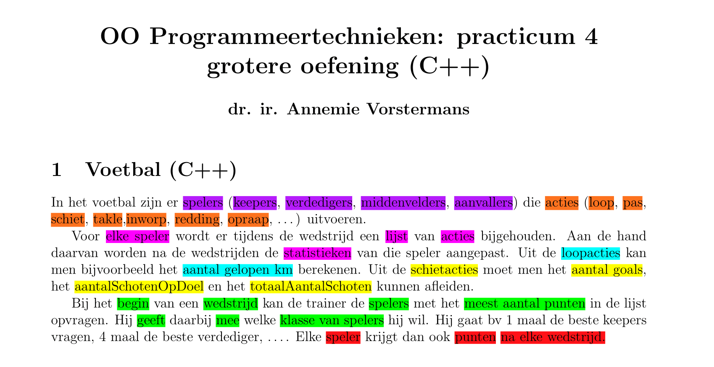

# Examen: OO Programeertechnieken
## Authors
- [Romeo Permentier](https://github.com/ro-per)
## About this project
- [Teacher: Annemie Vorstermans](https://www.kuleuven.be/wieiswie/nl/person/00059650)
- [Course: OO programmeertechnieken ](https://onderwijsaanbod.kuleuven.be/syllabi/n/JPI0UAN.htm#activetab=doelstellingen_idp992608)
- Subject: Oefening over verschillende voetballers

## Assignement

- 3 soorten methoden
- methode die alle spelers hebben
- methode die alle spelers hebben maar specifiek per spelers
- methode per specifiek speler (bij verdediger bijvoorbeeld) --> dynamic cast

- acties dynamisch maken --> new Actie(); ...
- punten bijhouden (som)
- aantal wedstrijden bijhouden

- spelers zitten in een team

- in main alles hard coderen
- acties en invoer (acties wel dynamisch)

- werken met iterator

- dynamic cast --> (of type id) voorbeeld functie loop die elke 
- if typeid= schietactie --> pointer casten van actie naar schietactie 